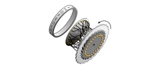

# The Enigma Machine
An Enigma machine is a device that can encrypt and decrypt messages that are written in a fixed sized alphabet
(usually the 26 upper-case Latin letters A-Z). Figure below shows how a battery powered Enigma machine with a four
letter alphabet (ASDF) is wired. The machine is essentially an electric circuit that connects the input switches to
the lights on the output board. In between the input switches and output board there is a complex mechanism that
continually re-routes the circuit, thus scrambling the original message. 

 

The key components of an Enigma machine are:
- a set of input switches (1)
- a plugboard (2) with a number of plug cables (3)
- a number of rotors (4)
- a reflector (5)
- an output board (6)

To send a message securely over a public channel (e.g. radio), two identically configured Enigma machines are
needed. One operator composes a message and types it one character a time using their Enigma machine’s input
switches (1), which causes letters to light up on the output board (6). Another operator writes down this encrypted
sequence and transmits it over the radio. At the other end of the radio, an operator receives the encrypted sequence
of characters which he writes down. This sequence can then be typed into the receiver’s Enigma machine where
the decrypted characters can be read off of the output board.
Once configured, an Enigma machine encrypts its input using an invertible function. Thus, to decrypt a message
one needs only to type the encrypted ciphertext into an identically configured Enigma machine, and then read the
plaintext off the output board.

Below is a brief description of each component. For details, please see the [Wikipedia page](https://en.wikipedia.org/wiki/Enigma_machine).

## Components

As already mentioned, there are five key components to the Enigma machine. The input switches and output board
are straightforward. We shall discuss the plugboard, rotors, and reflector in more detail.

### Plugboard

When a key on the Enigma machine keyboard is pressed, it closes the electrical circuit, and causes a signal to first
be sent to the plugboard. The plugboard consists of a series of contacts that can be connected by plugboard cables.
The effect of connecting two letters via plugboard cables is to swap those two letters’ input signals before sending
them to the rotors. In Figure 1, a plugboard cable swaps the inputs on D and S from the keyboard when sending
them to the first rotor and also swaps them when sending a signal back to the output board’s lights. If there is no
plugboard cable present then the input signal enters the rotors from its original position. For example, in Figure 1
the key A goes unmodified to the first rotor.

### Rotors
A rotor (4) is a wheel with the upper-case alphabet (in order) on the rim and a hole for an axle. On both sides of
a rotor are 26 contacts each under a letter. Each contact on one side is wired to a contact on the other side at a
different position, effectively mapping each letter to a different one.

 

An Enigma machine has several rotors with different wiring inside each. These can be arranged in any order on
the axle. At the start of the war, an Enigma machine had five different rotors available with room on the axle for
3three. The first part of setting up an Enigma machine was to put three rotors on the axle in the order set for the
day. The second part was to rotate the rotors manually to specified positions.
With three rotors in position there is a connection from each key (1) to the right contact on the first rotor
(4) and then through each rotor in turn, to the left side of the final rotor. The connection then goes through the
reflector (5) and then back through the rotors in the reverse order to the output board’s lights (6).
However, as well as simply mapping each input letter to a different output letter, the rotors can also rotate. The
effect of this rotation is to change the mapping between input and output. As shown in Fig. 2, the rotors rotate in
the opposite direction to the order in which the alphabet letters are inscribed on the rotor’s ring. After a rotation
of one position, for example, a signal on the ‘A’ input would actually enter the rotor in the previous ‘B’ position;
if the rotor maps the letter ‘B’ to the letter ‘G’, for example, then after the rotation the signal will exit the rotor
in the previous ‘F’ position. This behaviour is illustrated by the diagram below:

 

It was this rotation (coupled with the enormous number of possible starting configurations) that gave the Enigma
machine such a powerful encryption, since it implemented a polyalphabetic encoding - notice in the diagram above
that the two inputs of the letter ‘A’ are encoded using different output letters.
The rotors’ rotations were controlled by the input keyboard: every time a key was pressed, a lever would rotate
the right hand rotor one position before closing the electric circuit. Each rotor also had one or more notches,
aligned with the letters on the rim, which would engage the rotor to its left as it turned. Thus, the rotors behaved
somewhat like an odometer in a car 3 .

### Reflector

The reflector (5) is a device at the end of the rotors which has contacts for each letter of the alphabet on one side
only. The letters are wired up in pairs, so that an input current on one letter is output back to a different letter.
As mentioned above, it causes the input signal to be reflected back through the rotors and plugboard, and then
into one of the bulbs on the output board.
